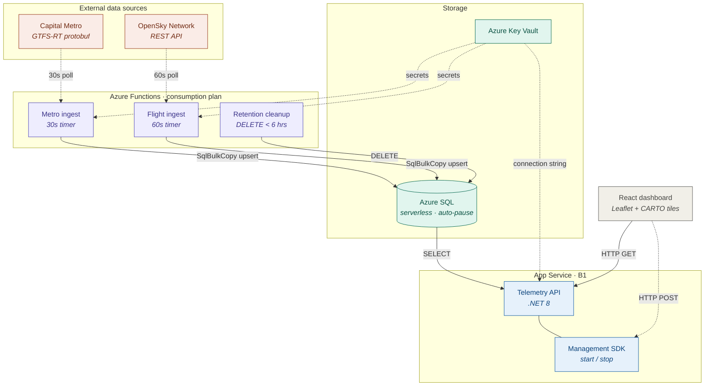

# Azure Telemetry Platform

A production-quality reference platform demonstrating SRE engineering practices on Azure PaaS. Ingests real-time vehicle position data from two live public feeds — Capital Metro buses (GTFS-RT protobuf) and OpenSky Network flights (REST JSON) — stores them in Azure SQL Serverless, and serves them through a .NET 8 Minimal API to a React + Leaflet live map dashboard.

---

## Architecture Overview



**Additional infrastructure:**
- Azure Key Vault — secret management via Managed Identity (no plaintext secrets anywhere)
- Application Insights — distributed tracing, custom metrics, staleness alerts
- RetentionCleanup Function — daily purge of records older than 24h (cost control)

---

## Repository Structure

```
azure-telemetry-platform/
├── scripts/
│   └── seed-local-db.sql          # Local dev DB setup
├── src/
│   ├── TelemetryApi/              # .NET 8 Minimal API
│   ├── MetroIngestion/            # Azure Function — GTFS-RT
│   ├── FlightIngestion/           # Azure Function — OpenSky
│   ├── RetentionCleanup/          # Azure Function — daily purge
│   └── TelemetryApi.Tests/        # xUnit integration tests
├── dashboard/                     # React + Vite + Leaflet
├── infra/                         # Terraform modules
│   └── modules/
│       ├── sql/
│       ├── keyvault/
│       ├── appservice/
│       ├── functions/
│       ├── monitoring/
│       └── staticweb/
├── docs/
│   ├── runbook.md
│   ├── postmortem-template.md
│   └── architecture-decisions.md
├── .github/workflows/
│   ├── ci.yml                     # Build + test on every push/PR
│   └── deploy.yml                 # Deploy to Azure on merge to main
├── .env.example                   # Environment variable reference
└── azure-telemetry-platform.sln
```

---

## Local Development

### Prerequisites

- .NET 8 SDK
- SQL Server Express / LocalDB
- Node.js 20+
- Azure Functions Core Tools v4

### 1. Database setup

```bash
# Create the schema and seed 10 sample rows
sqlcmd -S "(localdb)\mssqllocaldb" -i scripts/seed-local-db.sql
```

### 2. Run the API

```bash
cd src/TelemetryApi
dotnet run
# Listening on http://localhost:5000
```

Test endpoints:
```bash
curl http://localhost:5000/api/health
curl http://localhost:5000/api/vehicles/current
curl http://localhost:5000/api/metrics
```

### 3. Run the Functions locally

```bash
# MetroIngestion
cd src/MetroIngestion
func start

# FlightIngestion (separate terminal)
cd src/FlightIngestion
func start

# RetentionCleanup (separate terminal)
cd src/RetentionCleanup
func start
```

### 4. Run the dashboard

```bash
cd dashboard
npm ci
npm run dev
# Open http://localhost:5173
```

### 5. Run tests

```bash
cd azure-telemetry-platform
dotnet test --configuration Release
```

---

## Deployment

### First-time infrastructure provisioning

```bash
cd infra

# Required: set sensitive variables (never commit these)
export TF_VAR_sql_admin_password="<strong-password>"
export TF_VAR_alert_email="oncall@example.com"

# Authenticate with Azure
az login

terraform init
terraform plan
terraform apply
```

After apply, retrieve the deployment secrets:
```bash
terraform output -raw static_web_api_key
```

Store the following as GitHub repository secrets:
| Secret | Value |
|---|---|
| `AZURE_CREDENTIALS` | Service principal JSON from `az ad sp create-for-rbac` |
| `APP_SERVICE_NAME` | `app-telemetry-prod` |
| `FUNCTION_APP_NAME` | `func-telemetry-prod` |
| `APP_SERVICE_HOSTNAME` | from `terraform output app_service_hostname` |
| `AZURE_STATIC_WEB_APPS_API_TOKEN` | from `terraform output -raw static_web_api_key` |

### Subsequent deployments

Push to `main` → CI workflow runs tests → deploy workflow deploys all three targets and runs a smoke test on `/api/health`.

---

## Monitoring & Alerting

### Azure Portal Quick Links
*(Replace `YOUR_SUBSCRIPTION_ID` in the URLs below)*
- 📊 **[App Insights Failures Blade](https://portal.azure.com/#view/AppInsightsExtension/FailuresV2Blade/ComponentId/%7B"Name"%3A"appi-telemetry-prod"%2C"SubscriptionId"%3A"YOUR_SUBSCRIPTION_ID"%2C"ResourceGroup"%3A"rg-telemetry-prod"%7D)** 
- 📈 **[Log Analytics Logs](https://portal.azure.com/#view/Microsoft_OperationsManagementSuite_Workspace/Logs.ReactView/resourceId/%2Fsubscriptions%2FYOUR_SUBSCRIPTION_ID%2FresourceGroups%2Frg-telemetry-prod%2Fproviders%2FMicrosoft.OperationalInsights%2Fworkspaces%2Flaw-telemetry-prod)**
- 🔔 **[Alert Rules Manager](https://portal.azure.com/#view/Microsoft_Azure_Monitoring/AlertsManagementBlade)**

Three alert rules fire on business-level failures (not just exceptions):

| Alert | Condition | Severity |
|---|---|---|
| Metro feed stale | 0 vehicles ingested × 3 polls | 2 (Warning) |
| Flight feed stale | 0 aircraft ingested × 3 polls | 2 (Warning) |
| API error rate | HTTP 5xx > 5% over 5 min | 1 (Error) |

Alerts route to the email address specified in `var.alert_email`.

KQL query for manual investigation (Application Insights → Logs):
```kql
customMetrics
| where name == "vehicles_ingested"
| summarize avg(value) by bin(timestamp, 5m), tostring(customDimensions["source"])
| render timechart
```

---

## Design Decisions

See [`docs/architecture-decisions.md`](docs/architecture-decisions.md) for full ADRs.

Key choices:
- **Serverless SQL** — auto-pauses at night, reducing ~70% compute cost vs. provisioned
- **SqlBulkCopy** — single batch insert per poll vs. N individual INSERTs
- **GTFS-RT protobuf** — binary format, ~10× smaller than equivalent JSON
- **Managed Identity** — eliminates credential rotation as an operational concern
- **Zero-vehicle metric** — catches "Function ran but data source was empty" silently
