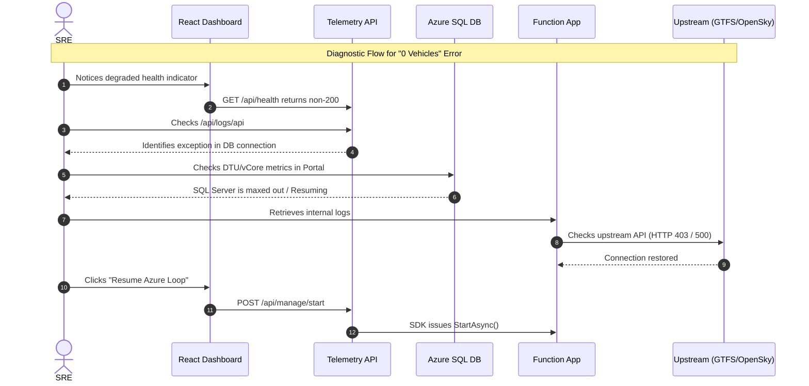

# Operations Runbook — Azure Telemetry Platform — SRE Runbook



**Last updated:** 2025-01  
**Owner:** Platform SRE  
**Scope:** Production incident response for all components

---

## Table of Contents

1. [Service Overview](#1-service-overview)
2. [Health Checks](#2-health-checks)
3. [Alert Playbooks](#3-alert-playbooks)
   - 3.1 Metro Feed Stale
   - 3.2 Flight Feed Stale
   - 3.3 API High Error Rate
4. [Common Operational Tasks](#4-common-operational-tasks)
5. [Escalation Path](#5-escalation-path)

---

## 1. Service Overview

| Component | Resource | SKU | Criticality |
|---|---|---|---|
| TelemetryApi | `app-telemetry-prod` | B1 App Service | High |
| MetroIngestion | `func-telemetry-prod` | Consumption | Medium |
| FlightIngestion | `func-telemetry-prod` | Consumption | Medium |
| RetentionCleanup | `func-telemetry-prod` | Consumption | Low |
| Database | `sql-telemetry-prod/TelemetryDb` | Serverless GP_S_Gen5_1 | High |
| Dashboard | `stapp-telemetry-prod` | Static Web App Free | Medium |
| Key Vault | `kv-telemetry-prod` | Standard | High |
| App Insights | `appi-telemetry-prod` | Workspace-based | High |

**SLO:** `/api/health` returns HTTP 200 with `status: "healthy"` for ≥99% of minutes in a 30-day rolling window.

### Azure Portal Quick Links

*(Pro-tip: The subscription ID has been injected to make these direct links work locally!)*

- 📊 **[App Insights Failures Blade](https://portal.azure.com/#@/resource/subscriptions/780f4576-d4f2-4959-a6a9-0c61fd12b7ca/resourceGroups/rg-telemetry-atp-prod/providers/microsoft.insights/components/appi-telemetry-prod/troubleshoot)** — View exceptions and HTTP 5xx stack traces
- 📈 **[SRE Operations Dashboard](https://portal.azure.com/#view/Microsoft_Azure_Monitoring/Workbook.ReactView/id/%2Fsubscriptions%2F780f4576-d4f2-4959-a6a9-0c61fd12b7ca%2FresourceGroups%2Frg-telemetry-atp-prod%2Fproviders%2FMicrosoft.Insights%2Fworkbooks%2Ff92d6459-6f1e-5c7e-9c45-3916bc85aaad)** — Real-time SLO burn rate and system health
- 📈 **[Log Analytics Logs](https://portal.azure.com/#@/resource/subscriptions/780f4576-d4f2-4959-a6a9-0c61fd12b7ca/resourceGroups/rg-telemetry-atp-prod/providers/microsoft.operationalinsights/workspaces/law-telemetry-prod/logs)** — Run custom KQL metrics queries
- 🔔 **[Alert Rules Manager](https://portal.azure.com/#@/resource/subscriptions/780f4576-d4f2-4959-a6a9-0c61fd12b7ca/resourceGroups/rg-telemetry-atp-prod/providers/Microsoft.Insights/metricalerts/alert-api-5xx-prod)** — Check active fired alerts
- ☁️ **[Azure SQL Performance](https://portal.azure.com/#@/resource/subscriptions/780f4576-d4f2-4959-a6a9-0c61fd12b7ca/resourceGroups/rg-telemetry-atp-prod/providers/Microsoft.Sql/servers/sql-telemetry-prod-7d94f06a/databases/TelemetryDb)** — View DTU/vCore utilization

---

## 2. Health Checks

> [!NOTE]
> **Telemetry Window Discrepancy**  
> There is a deliberate polling window discrepancy separating the data retrieval endpoints. `GetCurrentVehiclesAsync` (used by the dashboard map) operates on a strict **5m window** to avoid plotting stale ghost positions. In contrast, `GetSourceHealthAsync` (the actual SRE threshold monitor) utilizes a padded **15m window**. This intentional buffer prevents SRE dashboard noise and false-positive pipeline teardowns caused by brief upstream provider latency, routine Azure Serverless cold starts, or expected sub-minute schedule gaps.

### Quick status commands

```bash
# API health (should return {"status":"healthy",...})
curl https://app-telemetry-prod.azurewebsites.net/api/health | jq .

# API metrics
curl https://app-telemetry-prod.azurewebsites.net/api/metrics | jq .

# Function App status
az functionapp show \
  --name func-telemetry-prod \
  --resource-group rg-telemetry-prod \
  --query "state"

# SQL database status (auto-pause check)
az sql db show \
  --server sql-telemetry-prod \
  --resource-group rg-telemetry-prod \
  --name TelemetryDb \
  --query "status"
```

### KQL queries (Application Insights -> Logs)

Application Insights provides rich custom telemetry covering exactly what cloud components failed. If the React Dashboard UI cannot pull logs via the formal Rest API, simply view Azure Portal:

```bash
az functionapp stop --name func-telemetry-prod --resource-group rg-telemetry-prod
# Allows Azure Serverless SQL General Purpose compute instances to auto-pause saving 90% of local costs overnight!
```

**Vehicle ingestion rate by source (last 30 min):**
```kql
customMetrics
| where timestamp > ago(30m)
| where name == "vehicles_ingested"
| summarize avg(value) by bin(timestamp, 1m), tostring(customDimensions["source"])
| render timechart
```

**Zero-vehicle events (staleness indicator):**
```kql
customMetrics
| where name == "vehicles_ingested_zero"
| summarize count() by bin(timestamp, 5m), tostring(customDimensions["source"])
| render timechart
```

**API error rate:**
```kql
requests
| where timestamp > ago(1h)
| summarize
    total = count(),
    failed = countif(success == false)
    by bin(timestamp, 5m)
| extend error_rate = toreal(failed) / toreal(total) * 100
| render timechart
```

---

## 3. Alert Playbooks

### 3.1 Metro Feed Stale

**Alert name:** `alert-metro-feed-stale-prod`  
**Fires when:** `vehicles_ingested_zero{source=metro}` fires 3+ times in 5 minutes  
**Meaning:** MetroIngestion Function is running but the Capital Metro GTFS-RT feed is returning 0 vehicles.

**Investigation steps:**

1. Check if the Function is running:
   ```bash
   az monitor activity-log list \
     --resource-id /subscriptions/.../func-telemetry-prod \
     --start-time $(date -u -d '1 hour ago' +%Y-%m-%dT%H:%M:%SZ) \
     --query "[].{time:eventTimestamp,status:status.value,operation:operationName.value}"
   ```

2. Check Function logs in App Insights:
   ```kql
   traces
   | where cloud_RoleName == "MetroIngestion"
   | where timestamp > ago(1h)
   | order by timestamp desc
   | take 50
   ```

3. Verify the upstream feed is accessible:
   ```bash
   curl -I "https://data.texas.gov/download/eiei-9rpf/application%2Foctet-stream"
   # Expected: HTTP 200, Content-Type: application/octet-stream
   ```

4. Check the feed size is non-zero:
   ```bash
   curl -s "https://data.texas.gov/download/eiei-9rpf/application%2Foctet-stream" | wc -c
   # A value < 100 bytes suggests an empty or error response
   ```

**Resolution:**
- If the feed URL is down: alert is self-resolving when Capital Metro restores the feed. No action required. Update the status page.
- If the Function is not triggering: restart it via the portal or `az functionapp restart --name func-telemetry-prod --resource-group rg-telemetry-prod`.
- If the database is auto-paused and timing out: the Function's retry policy should recover automatically within 90 seconds.

---

### 3.2 Flight Feed Stale

**Alert name:** `alert-flight-feed-stale-prod`  
**Fires when:** `vehicles_ingested_zero{source=flight}` fires 3+ times in 5 minutes  
**Meaning:** FlightIngestion is running but OpenSky returned 0 airborne aircraft over Austin.

**Note:** This can be a legitimate condition at 3–5 AM local time (very low air traffic). Do not wake anyone up overnight for this alert.

**Investigation steps:**

1. Verify OpenSky is reachable:
   ```bash
   BBOX="29.8,-98.2,30.8,-97.2"
   curl -s "https://opensky-network.org/api/states/all?lamin=29.8&lomin=-98.2&lamax=30.8&lomax=-97.2" | jq .states | length
   # During daytime: should return 10–100+ aircraft
   # During 3-5 AM: may legitimately return 0
   ```

2. Check for OpenSky rate limiting (HTTP 429):
   ```kql
   traces
   | where cloud_RoleName == "FlightIngestion"
   | where message contains "429" or message contains "rate"
   | order by timestamp desc
   ```

**Resolution:**
- Rate limited: OpenSky free tier allows 400 credits/day (1 credit per 10-second query). If exhausted, wait until midnight UTC for the quota to reset.
- True outage: self-resolving. No action required.

---

### 3.3 API High Error Rate

**Alert name:** `alert-api-5xx-prod`  
**Fires when:** `requests/failed` > 5 in a 5-minute window  
**Meaning:** TelemetryApi is returning HTTP 5xx errors.

**Investigation steps:**

1. Check App Service diagnostics:
   ```bash
   az webapp log tail \
     --name app-telemetry-prod \
     --resource-group rg-telemetry-prod
   ```

2. Check App Insights failures blade:
   ```kql
   exceptions
   | where timestamp > ago(30m)
   | summarize count() by type, outerMessage
   | order by count_ desc
   ```

3. Common causes and fixes:

   | Symptom | Cause | Fix |
   |---|---|---|
   | `SqlException: Login failed` | Key Vault secret stale or Key Vault unreachable | Verify managed identity access policy; restart App Service |
   | `SqlException: The service is not currently available` | SQL auto-resume in progress | Wait 30s and recheck; the next request will succeed |
   | `System.TimeoutException` | DB connection pool exhausted | Scale App Service plan or check for long-running queries |
   | HTTP 503 from App Service | App Service restart/swap | Wait for health check to pass |

4. Emergency restart:
   ```bash
   az webapp restart \
     --name app-telemetry-prod \
     --resource-group rg-telemetry-prod
   ```

---

## 4. Common Operational Tasks

### Rotate the SQL admin password

```bash
# 1. Generate new password
NEW_PASS=$(openssl rand -base64 32)

# 2. Update SQL server
az sql server update \
  --name sql-telemetry-prod \
  --resource-group rg-telemetry-prod \
  --admin-password "$NEW_PASS"

# 3. Update Key Vault secret
az keyvault secret set \
  --vault-name kv-telemetry-prod \
  --name SQL-CONNECTION-STRING \
  --value "Server=tcp:sql-telemetry-prod.database.windows.net,1433;Initial Catalog=TelemetryDb;Persist Security Info=False;User ID=sqladmin;Password=${NEW_PASS};Encrypt=True;"

# 4. Restart App Service and Function App to pick up new secret
az webapp restart --name app-telemetry-prod --resource-group rg-telemetry-prod
az functionapp restart --name func-telemetry-prod --resource-group rg-telemetry-prod
```

### Manually trigger a Function run

```bash
# Useful when testing after a config change
curl -X POST "https://func-telemetry-prod.azurewebsites.net/admin/functions/MetroIngestionFunction" \
  -H "x-functions-key: $(az functionapp keys list --name func-telemetry-prod --resource-group rg-telemetry-prod --query masterKey -o tsv)" \
  -H "Content-Type: application/json" \
  -d '{}'
```

### Query the database directly (break-glass)

```bash
# Use Azure Cloud Shell or az sql query
az sql query \
  --server sql-telemetry-prod \
  --database TelemetryDb \
  --resource-group rg-telemetry-prod \
  --query "SELECT source, COUNT(*) AS cnt, MAX(ingested_at) AS latest FROM vehicles GROUP BY source"
```

### Scale App Service plan

```bash
# Temporarily scale up during load testing or high traffic
az appservice plan update \
  --name asp-telemetry-prod \
  --resource-group rg-telemetry-prod \
  --sku B2
```

---

## 5. Escalation Path

| Level | Contact | When |
|---|---|---|
| L1 | On-call engineer (alert email) | Any alert fires |
| L2 | Platform SRE lead | Alert not resolved within 30 minutes |
| L3 | Azure Support | Confirmed Azure platform issue (check [status.azure.com](https://status.azure.com)) |
