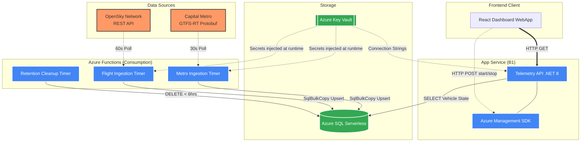

# Architecture Decision Records
## System Overview Diagram

## ADR-001: Azure SQL Serverless over Provisioned Compute

**Date:** 2025-01  
**Status:** Accepted

### Context

The telemetry workload has a clear diurnal pattern: high ingestion frequency during Austin business hours (6 AM – 11 PM local), near-zero activity overnight. A provisioned DTU/vCore tier runs at full cost 24/7 regardless of demand.

### Decision

Use Azure SQL Serverless (General Purpose, 1 vCore) with auto-pause after 60 minutes of inactivity.

### Consequences

- **Cost:** Auto-pause reduces compute billing by ~65–70% in practice. Storage billing continues regardless.
- **Latency:** First query after auto-pause incurs a 10–30s "cold start" while the database resumes. This affects the ingestion Functions, not end users — the dashboard never queries SQL directly.
- **Mitigation:** The Polly retry policy in each ingestion service has a 30-second fixed delay, which absorbs the resume latency transparently.

---

## ADR-002: SqlBulkCopy over Row-by-Row INSERT

**Date:** 2025-01  
**Status:** Accepted

### Context

Each ingestion cycle inserts 30–200 rows (metro vehicles) or 50–500 rows (flight states). Using individual parameterized INSERTs would require N round trips per cycle, burning DTU/vCore budget and adding latency.

### Decision

Use `SqlBulkCopy` with a `DataTable` built in memory from the parsed feed entities.

### Consequences

- **Throughput:** A single `WriteToServerAsync` call sends all rows in one TDS batch.
- **Atomicity:** The entire batch is inserted or fails as a unit. The `MERGE` upsert pattern was considered but rejected — `SqlBulkCopy` into a staging table followed by a MERGE adds complexity without adding value here since positions are append-only and duplicates are acceptable (dashboard shows latest-per-vehicle via a window function query).
- **Error isolation:** Per-record exception handling wraps individual row construction; a malformed record is logged and skipped rather than aborting the entire batch.

---

## ADR-003: Managed Identity over Service Principal Credentials

**Date:** 2025-01  
**Status:** Accepted

### Context

Connecting App Service and Azure Functions to Azure SQL and Key Vault requires authentication. Options:
1. Connection string with username/password stored in app settings
2. Service principal client ID + secret stored in app settings
3. System-assigned Managed Identity (no stored credential)

### Decision

System-assigned Managed Identity on both the App Service and Function App, with Key Vault access policies granting `Get`/`List` secret permissions to each identity's object ID.

The SQL connection string itself is stored as a Key Vault secret and referenced via the `@Microsoft.KeyVault(SecretUri=...)` syntax in App Service application settings — meaning the plaintext credential is never present in the portal, deployment artifacts, or environment variables.

### Consequences

- **Security:** No credentials to rotate, leak, or accidentally commit. The identity is tied to the Azure resource lifecycle — deleting the App Service automatically revokes access.
- **Complexity:** Requires Terraform to know the managed identity principal IDs before granting Key Vault access, creating a dependency ordering constraint. Handled by provisioning appservice and functions modules before keyvault.
- **Local development:** `DefaultAzureCredential` falls back to the Azure CLI credential, so `az login` is sufficient for local development without any environment variable changes.

---

## ADR-004: Single Azure Function App for Three Functions

**Date:** 2025-01  
**Status:** Accepted

### Context

The three Functions (MetroIngestion, FlightIngestion, RetentionCleanup) could each be deployed to separate Function Apps (isolation, independent scaling) or co-located in one Function App (simplicity, shared cold start).

### Decision

Co-locate all three in a single Function App.

### Consequences

- **Simplicity:** One deployment target, one set of app settings, one managed identity to configure.
- **Isolation:** Azure Functions runtime runs each function trigger independently. A crash in MetroIngestion does not affect FlightIngestion. Per-function exception handling (`try/catch` within each `RunAsync`) provides additional isolation.
- **Scaling:** Consumption plan scales the entire Function App as a unit. If MetroIngestion required dramatically different compute from the others (it doesn't), separation would be warranted.
- **Cost:** One consumption plan vs. three. The difference is negligible at this scale.

---

## ADR-005: Polling Architecture over Event-Driven

**Date:** 2025-01  
**Status:** Accepted

### Context

Vehicle position updates could theoretically be delivered via push (webhook, Event Hub). Both upstream data sources (Capital Metro GTFS-RT, OpenSky Network) are pull-only REST/protobuf feeds — neither provides a push mechanism.

### Decision

Timer-triggered Azure Functions polling the upstream feeds on fixed schedules (30s for metro, 60s for flights).

### Consequences

- **Simplicity:** No event broker, no consumer group management, no at-least-once delivery semantics to implement.
- **Latency:** Positions are at most 30s (metro) or 60s (flights) stale at the API level. Acceptable for a map visualization that refreshes every 30s.
- **Upstream dependency:** The platform's data freshness is bounded by the upstream feed update frequency. Capital Metro updates vehicle positions every 15–30 seconds; OpenSky updates every 10 seconds. Polling at 30s/60s intervals does not over-fetch.
- **Rate limits:** OpenSky free tier provides 400 API credits/day. At 60s intervals: 1440 requests/day = 1440 credits. This is over the free limit; a registered (but still free) account provides 4000 credits/day. The `OPENSKY_BBOX` is kept narrow (Austin metro area) to minimize response size.

---

## ADR-006: React + Leaflet over a Managed Map Service

**Date:** 2025-01  
**Status:** Accepted

### Context

Options for the map visualization:
1. Azure Maps (managed service, pay-per-tile-load)
2. Mapbox (managed service, API key required, usage-based billing)
3. Leaflet + OpenStreetMap/CARTO tiles (open source, free tiles)

### Decision

Leaflet 1.9 with CARTO Positron tile layer (free, no API key, suitable for data overlays).

### Consequences

- **Cost:** Zero tile-load costs at any traffic volume.
- **Capability:** Leaflet covers all requirements: markers, popups, zoom, pan, custom `DivIcon` SVG markers.
- **Performance:** `VehicleMarker` uses the imperative Leaflet API (`marker.setLatLng()`) for position updates rather than destroying and recreating React components, avoiding unnecessary DOM churn during 30-second refresh cycles.
- **Offline:** CARTO tiles require internet access. For a production deployment with strict data residency requirements, self-hosted tiles (e.g., via `tileserver-gl`) would be substituted.
